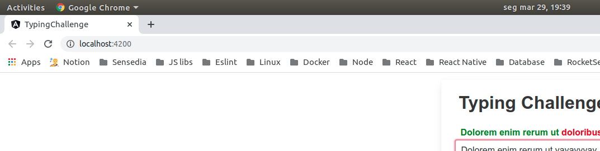
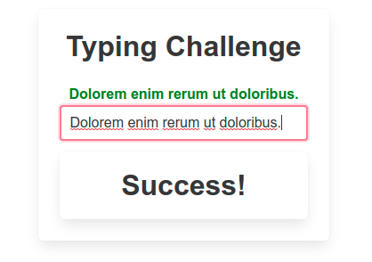

# Typing Challenge

This project made in Angular compare each word and return color GREEN if the index is OK or RED if index is false.

Check the screenshots below

## Installing and Development server

[1] - Clone this repo.

[2] - Inside this project folder run `npm install`.

[3] - Run `ng serve` or `npm start` for a dev server. Navigate to `http://localhost:4200/`. The app will automatically reload if you change any of the source files.
Steps Angular do to generate password :
